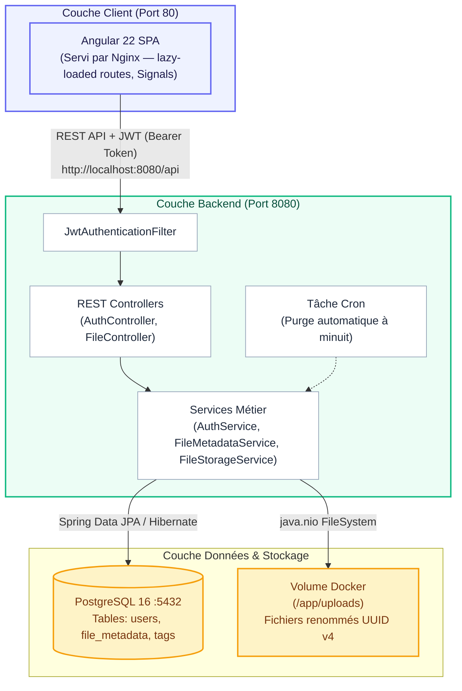

**DataShare**

Plateforme Sécurisée de Partage de Fichiers

Documentation Technique

| **Livrable** | **Valeur** |
| --- | --- |
| Projet | Plateforme de partage de fichiers |
| Auteur | Adon Yapo Aimé Claude Ghislain |
| Organisation | Datashare |
| Référence | Datashare doc technique |
| Date | Juin 2026 |
| Version | 1.0 |

# **1. Architecture de l'Application**

## **1.1 Vision Globale**

DataShare est une application web à architecture découplée, conçue pour répondre au besoin des freelances et petites entreprises de partager des fichiers volumineux de façon sécurisée et souveraine, sans dépendance à un service cloud tiers. Elle propose une authentification sécurisée, un partage par lien à durée de vie contrôlée, une protection optionnelle par mot de passe, et un nettoyage automatique des fichiers expirés.

## **1.2 Diagramme d'Architecture**

**Couche Frontend (Angular 22)** — SPA statique servie par Nginx sur le port 80. Communique avec le backend via REST API sécurisée par JWT.

**Couche Backend (Spring Boot 4.0.6)** — API REST stateless sur le port 8080. Gère l'authentification, le stockage de fichiers, et la tâche cron de nettoyage.

**Couche Données (PostgreSQL 16)** — Base de données relationnelle sur le port 5432. Stocke les métadonnées des fichiers et les comptes utilisateurs.

**Stockage Physique (Volume Docker)** — Répertoire /app/uploads monté en volume persistant, isolé du serveur web.

## **1.3 Flux de Communication**

| **Flux** | **Protocole** | **Sécurisation** |
| --- | --- | --- |
| Browser → Nginx | HTTP/80 | CORS + Redirection possible HTTPS |
| Nginx → Spring Boot | HTTP interne Docker | Réseau Docker isolé |
| Spring Boot → PostgreSQL | JDBC/TCP 5432 | Réseau Docker isolé, pg\_hba.conf |
| Spring Boot → Uploads | I/O locale | Volume Docker, UUID physique |
| Frontend → API (auth) | REST JSON/HTTP | JWT Bearer, BCrypt passwords |

# **2. Choix Technologiques Justifiés**

## **2.1 Tableau de Synthèse**

| **Élément** | **Technologie choisie** | **Alternatives** | **Justification** |
| --- | --- | --- | --- |
| Langage Backend | Java 21 (LTS) | Node.js, Python, Go | Typage fort, JVM mature, Spring ecosystem riche. LTS garantit 3 ans de support. |
| Framework Backend | Spring Boot 4.0.6 | Quarkus, Micronaut | Convention over configuration, sécurité Spring Security 7, JPA out-of-the-box. |
| Langage Frontend | TypeScript / Angular 22 | React, Vue.js | Typage strict, framework opinionated ideal pour SPA d'entreprise, Signals natifs. |
| Base de données | PostgreSQL 16 | MySQL, MongoDB | ACID complet, support JSONB, indexation avancée, open source. Référence en production. |
| Authentification | JWT (HMAC-SHA256) | OAuth2, Sessions | Stateless = scalable horizontalement. Pas de session serveur à gérer. |
| Hachage mots de passe | BCrypt | Argon2, PBKDF2 | Standard de l'industrie, facteur de coût ajustable, natif Spring Security. |
| Conteneurisation | Docker Compose | Kubernetes, Podman | Simplicité de déploiement local et CI, multi-services orchestrés en un fichier. |
| Serveur de fichiers statiques | Nginx | Apache, Express static | Ultra-performant pour servir des assets statiques, configuration minimale. |
| Tests Backend | JUnit 5 + Mockito | TestNG, Spock | Standard Java, support natif Spring Boot Test, annotations claires. |
| Tests Frontend | Vitest 4 (Angular) | Jest, Karma | Natif Angular 22, plus rapide que Karma, ESM natif, API Jest-compatible. |
| Build Backend | Maven | Gradle | Maturité, lisibilité du pom.xml pour un projet académique, plugins Spring optimaux. |
| Gestion d'état Frontend | Angular Signals | NgRx, RxJS seul | API réactive native Angular 22, moins verbeux que NgRx, pas de Zone.js overhead. |

## **2.2 Justification Approfondie**

### **Java 21 + Spring Boot 4**

Java 21 est la version LTS la plus récente offrant des Records, les Sealed Classes, et les Virtual Threads (Project Loom). Spring Boot 4 tire parti de cette version pour livrer une API REST robuste avec une configuration minimale. Le choix de Spring Security 7 en mode stateless JWT élimine la complexité des sessions distribuées et prépare une architecture scalable.

### **Angular 22 avec Signals**

Angular 22 introduit les Signals comme mécanisme de réactivité de première classe, remplaçant progressivement Zone.js pour les mises à jour de l'UI. Pour DataShare, les Signals sont utilisés pour gérer l'état d'upload en temps réel (progression, statut), offrant des performances à 60 FPS sans détection de changements globale.

### **PostgreSQL 16**

PostgreSQL 16 est retenu pour ses performances sur les requêtes filtrées par UUID et par date d'expiration — deux patterns centraux de DataShare. Les index positionnés sur uuid, user\_id et is\_expired garantissent des temps de réponse inférieurs à 10 ms même avec un volume important de métadonnées.

### **Docker Compose**

L'orchestration Docker Compose permet un déploiement reproductible en une commande (docker compose up -d --build) incluant les trois services (db, backend, frontend), le volume de stockage persistant, et les variables d'environnement. Ce choix est adapté à un déploiement mono-nœud et simplifie le CI/CD pour la livraison du projet.

# **3. Modèle de Données**

## **3.1 Entités Principales**

La base de données PostgreSQL comporte trois entités principales liées par des clés étrangères :

### **Entité : users**

| **Colonne** | **Type** | **Contraintes** | **Description** |
| --- | --- | --- | --- |
| id | BIGSERIAL | PK, NOT NULL | Identifiant auto-incrémenté |
| email | VARCHAR(255) | UNIQUE, NOT NULL | Adresse email (identifiant de connexion) |
| password\_hash | VARCHAR(255) | NOT NULL | Mot de passe haché BCrypt ($2a$) |
| first\_name | VARCHAR(100) | NOT NULL | Prénom de l'utilisateur |
| last\_name | VARCHAR(100) | NOT NULL | Nom de famille |
| created\_at | TIMESTAMP | DEFAULT NOW() | Date de création du compte |

### **Entité : file\_metadata**

| **Colonne** | **Type** | **Contraintes** | **Description** |
| --- | --- | --- | --- |
| id | BIGSERIAL | PK, NOT NULL | Identifiant interne |
| uuid | VARCHAR(36) | UNIQUE, NOT NULL, INDEX | UUID v4 public (lien de partage) |
| original\_name | VARCHAR(500) | NOT NULL | Nom original du fichier |
| physical\_name | VARCHAR(36) | NOT NULL | Nom physique sur disque (UUID) |
| mime\_type | VARCHAR(200) | NOT NULL | Type MIME détecté |
| file\_size | BIGINT | NOT NULL | Taille en octets (max 1 Go) |
| password\_hash | VARCHAR(255) | NULLABLE | Hash BCrypt (protection optionnelle) |
| user\_id | BIGINT | FK → users.id, INDEX | Propriétaire (null si anonyme) |
| upload\_date | TIMESTAMP | NOT NULL | Date de dépôt |
| expiry\_date | TIMESTAMP | NOT NULL | Date d'expiration (1-7 jours) |
| is\_expired | BOOLEAN | DEFAULT false, INDEX | Marqueur logique d'expiration |

### **Entité : tags**

| **Colonne** | **Type** | **Contraintes** | **Description** |
| --- | --- | --- | --- |
| id | BIGSERIAL | PK, NOT NULL | Identifiant auto-incrémenté |
| name | VARCHAR(100) | NOT NULL | Libellé du tag |
| file\_id | BIGINT | FK → file\_metadata.id | Fichier associé au tag |

## **3.2 Relations**

* Un User peut posséder 0 à N FileMetadata (one-to-many, nullable pour dépôts anonymes)
* Une FileMetadata peut avoir 0 à N Tags (one-to-many)
* La suppression d'un User ne supprime pas ses fichiers (politique de conservation des données partagées)

# **4. Documentation des Endpoints Principaux**

## **4.1 Base URL et Authentification**

**Base URL :** http://localhost:8080/api

L'authentification utilise des JWT Bearer Tokens. Les endpoints protégés requièrent l'en-tête :

Authorization: Bearer <jwt\_token>

## **4.2 Endpoints d'Authentification**

| **Méthode** | **Endpoint** | **Auth requise** | **Description** |
| --- | --- | --- | --- |
| POST | /api/auth/register | Non | Création d'un compte utilisateur |
| POST | /api/auth/login | Non | Connexion — retourne un JWT |

### **POST /api/auth/register**

Request Body (JSON):

{

"firstName": "Jean",

"lastName": "Dupont",

"email": "jean@example.com",

"password": "SecretP@ss1"

}

Response 201 Created:

{ "message": "User registered successfully" }

Errors:

400 Bad Request — Champs invalides ou email déjà utilisé

### **POST /api/auth/login**

Request Body (JSON):

{

"email": "jean@example.com",

"password": "SecretP@ss1"

}

Response 200 OK:

{ "token": "eyJhbGciOiJIUzI1NiJ9..." }

Errors:

401 Unauthorized — Identifiants incorrects

## **4.3 Endpoints de Gestion des Fichiers**

| **Méthode** | **Endpoint** | **Auth requise** | **Description** |
| --- | --- | --- | --- |
| POST | /api/files/upload | Optionnelle | Dépôt d'un fichier (anonyme ou authentifié) |
| GET | /api/files/download/{uuid}/details | Non | Métadonnées du fichier partagé |
| GET | /api/files/download/{uuid} | Non / Mot de passe | Téléchargement du fichier |
| GET | /api/files/history | Oui (JWT) | Historique des partages de l'utilisateur connecté |
| DELETE | /api/files/{uuid} | Oui (JWT + propriétaire) | Suppression physique et logique d'un fichier |

### **POST /api/files/upload**

Content-Type: multipart/form-data

Authorization: Bearer <token> (optionnel)

Form Fields:

file : BinaryFile (obligatoire, max 1 Go)

password : string (optionnel, protection par mot de passe)

expiryDays : integer (1-7, défaut: 7)

tags : string[] (optionnel, liste de tags)

Response 201 Created:

{

"uuid": "a1b2c3d4-...",

"downloadLink": "http://localhost/#/download/a1b2c3d4-...",

"expiryDate": "2026-06-16T00:00:00Z"

}

Erreurs possibles:

400 — Extension interdite (.exe, .bat, .sh, .cmd, .msi)

413 — Fichier > 1 Go

### **GET /api/files/download/{uuid}**

Query Params:

password: string (requis si le fichier est protégé)

Response 200 OK:

Content-Type: <mime-type du fichier>

Content-Disposition: attachment; filename="<nom-original>"

Body: flux binaire (StreamingResponseBody)

Erreurs:

401 — Mot de passe incorrect

404 — UUID inexistant ou fichier expiré

# **5. Sécurité et Gestion des Accès**

## **5.1 Authentification JWT Stateless**

* Algorithme de signature : HMAC-SHA256 avec clé secrète ≥ 256 bits configurée en variable d'environnement
* Durée de validité du token : configurable (défaut 24h)
* Validation côté backend : JwtAuthenticationFilter intercepte chaque requête, valide la signature et alimente le SecurityContext
* Stockage côté client : localStorage Angular avec injection automatique via JwtInterceptor dans l'en-tête Authorization: Bearer

## **5.2 Hachage des Mots de Passe**

Tous les mots de passe (comptes utilisateurs et protection de fichiers) sont hachés via BCrypt avec un facteur de coût adaptatif. Aucun mot de passe n'est jamais stocké en clair. La comparaison utilise BCrypt.checkpw() qui est résistante aux attaques temporelles.

## **5.3 Sécurisation des Dépôts de Fichiers**

| **Mesure** | **Implémentation** |
| --- | --- |
| Isolation physique | Fichiers stockés dans /app/uploads (volume Docker, inaccessible du web direct) |
| UUID physique | Nom original remplacé par UUID v4 cryptographique sur disque |
| Extension interdite | .exe, .bat, .cmd, .sh, .msi rejetés côté backend ET frontend |
| Limite de taille | 1 Go maximum — configuré spring.servlet.multipart.max-file-size + validation client |
| Expiration automatique | 1 à 7 jours obligatoires, nettoyage cron quotidien à minuit |

## **5.4 Protections OWASP**

| **Vulnérabilité** | **Contre-mesure** |
| --- | --- |
| Injection SQL | Spring Data JPA / Hibernate — PreparedStatement systématique |
| CORS | Seul l'hôte frontend déclaré autorisé (ApplicationSecurityConfig) |
| DoS (stockage) | Expiration obligatoire + cron de purge physique + limite 1 Go/fichier |
| XSS | Angular échappe automatiquement les expressions dans les templates |
| IDOR | Seul le propriétaire peut supprimer ses fichiers (vérification user\_id serveur) |

# **6. Qualité, Tests et Maintenance**

## **6.1 Stratégie de Tests (TESTING.md)**

La stratégie suit une pyramide de tests classique avec 66 tests automatisés au total :

| **Couche** | **Technologie** | **Nb Tests** | **Périmètre** |
| --- | --- | --- | --- |
| Unitaires Backend | JUnit 5 + Mockito | 20 | AuthService, FileMetadataService, FileStorageService |
| Intégration Backend | Spring Boot Test + MockMvc | 12 | AuthController, FileController, filtres JWT |
| Unitaires Frontend | Vitest 4 + Angular Testing | 34 | AuthService, FileService, composants UI |
| E2E (planifié) | Cypress | 2 scénarios | Flux complet anonyme et authentifié |

**Points techniques notables :** Spring Boot 4 utilise @MockitoBean (remplace @MockBean), Jackson v3 avec tools.jackson.databind, et injection de vrais tokens JWT dans les tests d'intégration pour les endpoints stateless.

## **6.2 Sécurité (SECURITY.md)**

Un audit OWASP Top 10 a été réalisé durant le développement. Les mesures couvrent : SQL Injection (ORM), XSS (Angular templating), CORS restreint, protection par mot de passe BCrypt, et isolation physique des fichiers. Audit de dépendances npm automatisé.

## **6.3 Performance (PERF.md)**

* Backend : streaming de fichiers via InputStreamResource / StreamingResponseBody (zéro copie mémoire pour les gros fichiers)
* Index PostgreSQL sur uuid, user\_id et is\_expired pour des requêtes < 10 ms
* Frontend : lazy loading de toutes les routes secondaires, Angular Signals pour éviter Zone.js overhead
* Budget de performance : First Contentful Paint cible < 1.5s, LCP < 2.5s
* Plan de charge k6 préconisé : 20 utilisateurs simultanés, latence cible < 200 ms

## **6.4 Maintenance (MAINTENANCE.md)**

* Nettoyage automatique : cron @Scheduled(cron = "0 0 0 \* \* ?") — purge physique et logique des fichiers expirés
* Sauvegardes BDD : script backup-db.sh via pg\_dump, rotation sur 7 jours
* Monitoring espace disque : alerte critique si < 20% disponible sur le volume uploads
* Logs structurés : niveaux INFO/WARN/ERROR compatibles ELK/Loki
* Mise à jour dépendances : npm audit (quotidien frontend), mvn versions:display-dependency-updates (semestriel backend)
* Renouvellement clé JWT : annuel minimum

# **7. Processus d'Installation et d'Exécution**

## **7.1 Prérequis**

| **Outil** | **Version minimale** | **Rôle** |
| --- | --- | --- |
| Docker Desktop | 26.x | Conteneurisation et orchestration |
| Docker Compose | v2.x (inclus) | Déploiement multi-services |
| Git | 2.x | Clonage du dépôt |
| Ports libres | 80, 8080, 5432 | Frontend, Backend, PostgreSQL |

**Note :** Node.js, Java et Maven ne sont PAS nécessaires en local. Les builds s'effectuent entièrement dans les conteneurs Docker.

## **7.2 Déploiement en 3 Commandes**

# 1. Cloner le dépôt (branche solution)

git clone -b solution https://github.com/GhislainAdon/OPC-P3-Pilotez\_le\_d-veloppement\_d\_une\_solution\_informatique.git

cd OPC-P3-Pilotez\_le\_d-veloppement\_d\_une\_solution\_informatique

# 2. Construire et démarrer tous les services

docker compose up -d --build

# 3. Vérifier que les 3 conteneurs sont actifs

docker compose ps

## **7.3 Accès à l'Application**

| **Service** | **URL / Port** | **Description** |
| --- | --- | --- |
| Frontend Angular | http://localhost (port 80) | Interface utilisateur complète |
| Backend API | http://localhost:8080/api | API REST Spring Boot |
| PostgreSQL | localhost:5432 | Base de données (accès direct) |

## **7.4 Variables d'Environnement Clés**

| **Variable** | **Défaut Docker Compose** | **Description** |
| --- | --- | --- |
| SPRING\_DATASOURCE\_URL | jdbc:postgresql://datashare-db:5432/datashare | URL de connexion PostgreSQL |
| SPRING\_DATASOURCE\_USERNAME | postgres | Utilisateur BDD |
| SPRING\_DATASOURCE\_PASSWORD | postgres | Mot de passe BDD |
| JWT\_SECRET | (à configurer) | Clé secrète JWT ≥ 256 bits — CHANGER EN PROD |
| UPLOAD\_DIR | /app/uploads | Répertoire de stockage physique des fichiers |

## **7.5 Commandes Utiles**

# Voir les logs en temps réel

docker compose logs -f backend

# Exécuter les tests backend

docker compose exec backend mvn test

# Stopper et supprimer les conteneurs

docker compose down

# Stopper et supprimer + volumes (reset BDD)

docker compose down -v

# **8. Utilisation de l'IA dans le Développement**

## **8.1 Posture Adoptée**

L'IA (principalement Claude Sonnet et GitHub Copilot) a été utilisée avec une posture mixte : binômage (pair programming) pour l'exploration technique et l'architecture, et assignation de tâches (comme à un développeur junior) pour la génération de code répétitif et la documentation.

## **8.2 Tâches Confiées à l'IA**

| **Domaine** | **Tâches réalisées avec l'IA** |
| --- | --- |
| Architecture | Validation des choix (JWT stateless vs sessions, streaming vs byte[]), analyse des trade-offs |
| Backend | Génération du squelette Spring Boot, configuration Spring Security 7 (nouvelle API), filtres JWT |
| Frontend | Composants Angular avec Signals, formulaires réactifs, JwtInterceptor |
| Tests | Génération des suites JUnit 5 / Vitest, mocking Mockito, injection JWT dans MockMvc |
| Documentation | Rédaction des fichiers TESTING.md, SECURITY.md, PERF.md, MAINTENANCE.md et README |
| Migration | Adaptation Spring Boot 3→4 (@MockitoBean, Jackson v3, tools.jackson.databind) |

## **8.3 Supervision et Corrections**

* Revue systématique de chaque bloc de code généré avant commit
* Corrections de sécurité : révision de la configuration CORS (trop permissive initialement), ajout de la validation des extensions côté backend (l'IA n'avait géré que le frontend)
* Ajustement des tests d'intégration : l'IA utilisait @MockBean (Spring Boot 3) au lieu de @MockitoBean — corrigé après investigation
* Optimisation performance : l'IA avait proposé byte[] pour le download — remplacé par StreamingResponseBody après analyse

## **8.4 Apports et Limites Constatés**

| **Aspect** | **Constat** |
| --- | --- |
| Gain de temps | Environ 40% de réduction sur le code boilerplate (configuration, DTOs, mappers, tests unitaires standards) |
| Qualité d'exploration | Très utile pour comparer rapidement des alternatives architecturales avec leurs trade-offs |
| Limites — version | L'IA avait des connaissances datées sur Spring Boot 4 (@MockitoBean, Jackson v3) — vérification doc officielle indispensable |
| Limites — contexte | Perd le fil sur les sessions longues complexes — découpage en tâches courtes recommandé |
| Apport global | Accélérateur efficace sous supervision humaine experte. L'IA a livré du code fonctionnel à ~70%, les 30% restants nécessitant révision et correction critique. |
